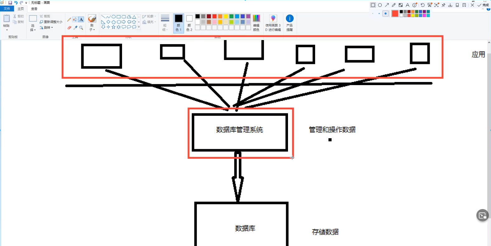
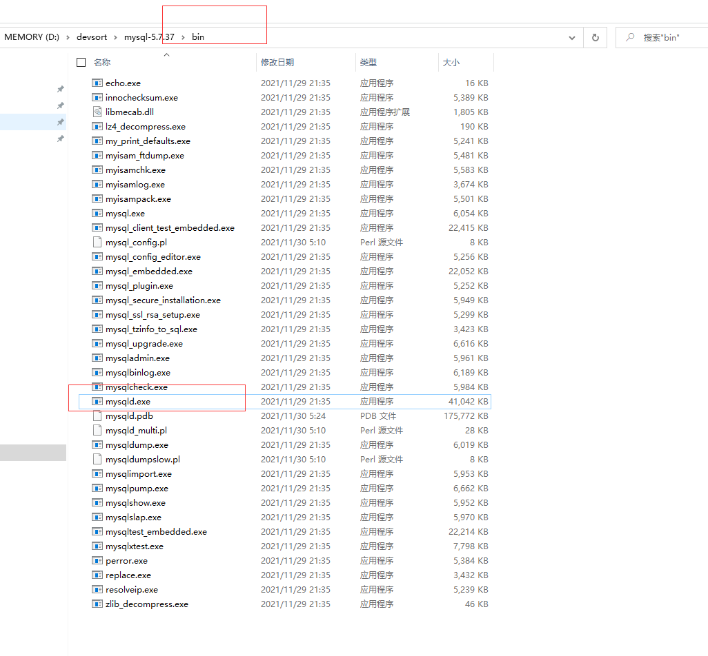
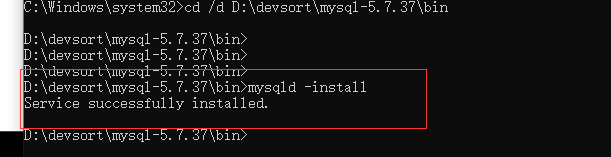
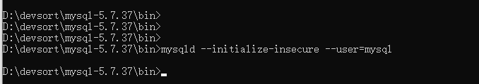
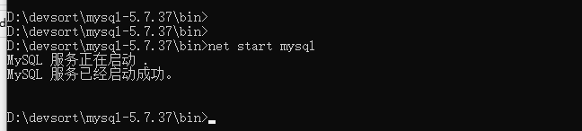
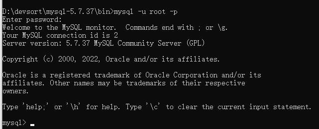
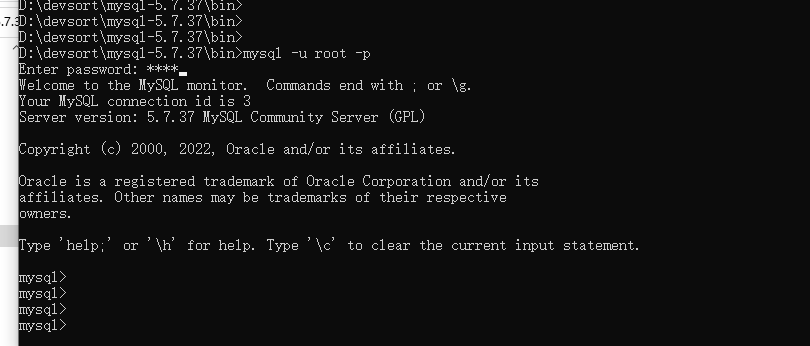
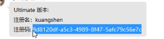

# Mysql

## 1、初始Mysql

javaEE：企业级java开发 Web

前端（页面：展示，数据！）

后台（连接数据库jdbc，链接前端（控制，控制视图跳转，和给前端传递数据））

数据库（存数据）

### 1.1 数据库分类

#### 关系型数据库：（SQL）

- MySQL，Oracle，Sql Server，DB2，SQLite
- 通过表和表之间，行和列之间的关系进行数据的存储，  学员信息表，考勤表.....

#### 非关系型数据库（No SQL） Not only

- Redis，MongDB
- 非关系型数据库，对象存储，通过对象的自身的属性来决定；

**DBMS（数据库管理系统）**

- 数据库的管理软件，科学有效的管理我们的数据，维护和获取数据；
- MySQL，数据库管理系统



### 1.2 MySQL简介

MySQL是一个**关系型数据库管理系统**

### 1.3 安装Mysql

1. 解压

2. 配置环境变量

3. 新建mysql配置文件my.ini

   ```ini
   [mysqld]
   basedir=D:\devsort\mysql-5.7.37\
   datadir=D:\devsort\mysql-5.7.37\data\
   port=3306
   skip-grant-tables
   ```

4. 启动管理员模式下的CMD，进入bin目录，运行所有的命令,安装mysql服务

   ```sql
   mysqld -install
   ```

   

   



5. 再输入命令初始化数据文件

   ```sql
   mysqld --initialize-insecure --user=mysql
   ```

   

6. 启动mysql，进去修改密码



​	7. 然后再次启动mysql然后用命令mysql -u root -p进入mysql管理界面（密码可为空)



8. 修改密码

```sql
update mysql.user set authentication_string=password('root') where user='root' and Host = 'localhost';
```

最后输入flush privileges;  刷新权限

9. 修改my.init文件删除最后一句skip-grant-tables

10. 重启mysql即可正常使用

    ```sql
    net stop mysql
    net start mysql
    ```

11. 重新连接测试出现以下结果就是安装好了





### 1.4 安装SQLyog

### 1.5 连接数据库

命令行连接

```sql
update mysql.user set authentication_string=password('root') where user='root' and Host = 'localhost'; -- 修改用户密码

flush privileges; -- 刷新权限

---------------------------------

show databases; -- 查看所有的数据库
use school; -- 切换数据库 
show tables; -- 查看数据库中所有的表
describe student; -- 显示数据中的所有的表的信息
create database westor; -- 创建一个数据库

exit; -- 退出连接

-- 单行注释
/*多行注释*/ 
```

### **1.6 数据库 xxx 语言**

DDL 	定义

DML	操作

DQL	查询

DCL	控制

详细来讲，可以分为六个部分

- ​	数据查询语言（DQL:Data Query Language）：
  　　其语句，也称为“数据检索语句”，用以从表中获得数据，确定数据怎样在应用程序给出。保留字SELECT是DQL（也是所有SQL）用得最多的动词，其他DQL常用的保留字有WHERE，ORDER BY，GROUP BY和HAVING。这些DQL保留字常与其他类型的SQL语句一起使用。


- 　数据操作语言（DML：Data Manipulation Language）：
  　　其语句包括动词INSERT，UPDATE和DELETE。它们分别用于添加，修改和删除表中的行。也称为动作查询语言。


- 事务处理语言（TPL）：
  　　它的语句能确保被DML语句影响的表的所有行及时得以更新。TPL语句包括BEGIN TRANSACTION，COMMIT和ROLLBACK。


- 数据控制语言（DCL）：
  　　它的语句通过GRANT或REVOKE获得许可，确定单个用户和用户组对数据库对象的访问。某些RDBMS可用GRANT或REVOKE控制对表单个列的访问。


- 数据定义语言（DDL）：
  　　其语句包括动词CREATE和DROP。在数据库中创建新表或删除表（CREAT TABLE 或 DROP TABLE）；为表加入索引等。DDL包括许多与人数据库目录中获得数据有关的保留字。它也是动作查询的一部分。


- 指针控制语言（CCL）：

　　它的语句，像DECLARE CURSOR，FETCH INTO和UPDATE WHERE CURRENT用于对一个或多个表单独行的操作。


## 2、操作数据库

操作数据库 ---> 操作数据库中的表  --->  操作数据库中表的数据

****

**mysql中关键字不区分大小写**

### 2.1 操作数据库

1. 创建数据库

   ```sql
   create database [if not exists] westos;
   ```

2. 删除数据库

   ```sql
   drop database [if not exists] hello;
   ```

3. 使用数据库

   ```sql
   -- tab 键的上面，如果你的表明或者字段名是一个特殊字符，就需要加 ``
   use 'school'
   ```

4. 查看数据库

   ```sql
   show databases;
   ```

学习思路：

- 对照sqlyog可视化历史记录查看sql
- 固定的语法或者关键字必须要强行记住！、

### 2.2 数据库的列类型

> 数值

- tinyint 		十分小的数据		1个字节
- smallint                                     2个字节
- mediumint                                3个字节  
- **int	                                          4个字节**
- bigint                                          8个字节
- float                                           4个字节
- double                                       8个字节
- **decimal      字符串形式的浮点数  金融计算的时候，一般是使用decimal**

> 字符串

- char 	    字符串固定大小的       0~255
- **varcahr    可变字符串                 0~65535   常用的String**
- tinyrtext    微型文本                     2^8 - 1
- **text            文本串                        2^16 - 1    保存大文本**

> 时间日期

​	java.util.Date


- date         YYYY-MM-DD  日期格式
- time         HH : mm : ss   时间格式
- **datetime   YYYY-MM-DD HH : mm : ss 最常用的时间格式**
- **timestamp   时间戳    1970.1.1 到现在的毫秒数  也较为常用！**
- year  年份表示


> null

- 没有值，未知
- **不要使用NULL进行运算**

### 2.3 数据库的字段属性(重点)

> unsigned

- 无符号整型
- 声明了该列不能为负数

> zerofill

- 0填充
- 不足位数，使用0来填充，int(3),  5---005

> 自增

- 通常理解为自增，自动在一条记录的基础上+1（默认）
- 通常用来设计唯一的主键~ index，必须是整数类型
- 可以自定义设计主键自增的起始值和步长

> 非空

- 假设设置为not null ，如果不给它赋值，就会报错
- null，如果不填写值，默认就是null

> 默认

- 设置默认的值


拓展：

```sql
/*每一个表，都必须存在以下五个字段

id   主键

`version` 乐观锁

is_delete  伪删除

gmt_create 创建时间

gmt_update 修改时间

*/
```


